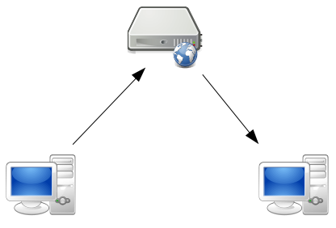
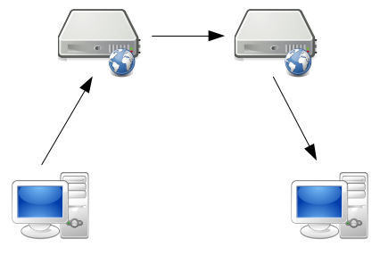

!SLIDE

 
<small>cc-by eff.org</small>

!SLIDE

# Wie kommunizieren wir im Internet?

!SLIDE smaller full-image

# Serverbasierte Kommunikation

<small>CC-BY-SA Marius Melzer, based on works by RRZEIcons, Everaldo Coelho and YellowIcon</small>

!SLIDE smaller full-image

# Föderierte Serverbasierte Kommunikation

<small>CC-BY-SA Marius Melzer, based on works by RRZEIcons, Everaldo Coelho and YellowIcon</small>

!SLIDE smaller

# Peer-to-Peer

<small>CC-BY-SA Marius Melzer, based on works by RRZEIcons, Everaldo Coelho and YellowIcon</small>
