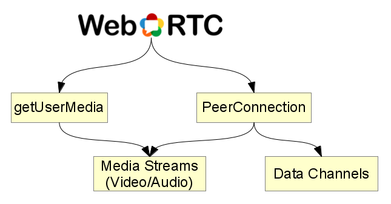

!SLIDE small-image

!SLIDE

# getUserMedia
## JavaScript Zugriff auf die Webcam!

!SLIDE example1-slide small

# getUserMedia Demo

<video id="ex" autoplay="autoplay">

!SLIDE small

# getUserMedia Demo

       @@@ javascript
       <video id="ex" autoplay="autoplay">

       

!SLIDE

# PeerConnection
## Verbindung zwischen beiden Teilnehmern

Benötigt einen externen "Signaling-Kanal"

Nutzbar für Audio/Video und Daten ("Data Channels")
